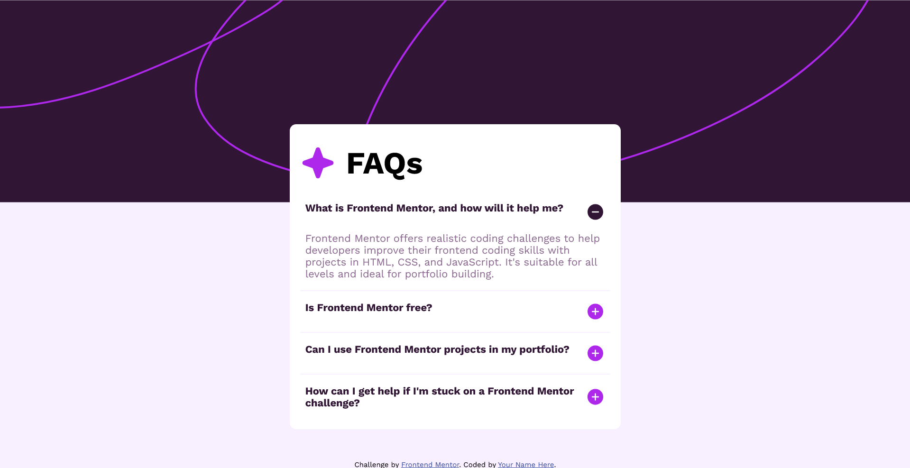

# Frontend Mentor - FAQ accordion solution

This is a solution to the [FAQ accordion challenge on Frontend Mentor](https://www.frontendmentor.io/challenges/faq-accordion-wyfFdeBwBz). Frontend Mentor challenges help you improve your coding skills by building realistic projects.

## Table of contents

- [Overview](#overview)
  - [Screenshot](#screenshot)
  - [Links](#links)
  - [Built with](#built-with)
- [Author](#author)

**Note: Delete this note and update the table of contents based on what sections you keep.**

## Overview

### Screenshot

### Links

- Solution URL: [Solution](https://www.frontendmentor.io/solutions/faq-accordion-solution-kUt-sQqvy2)
- Live Site URL: [Live](https://wasiqurzaman.github.io/faq-accordion-main-fementor/)

### Built with

- Semantic HTML5 markup
- CSS custom properties
- Flexbox

Wasiqur Zaman

- Frontend Mentor - [@wasiqurzaman](https://www.frontendmentor.io/profile/wasiqurzaman)
- Twitter - [@wasiqurzaman01](https://x.com/wasiqurzaman01)
